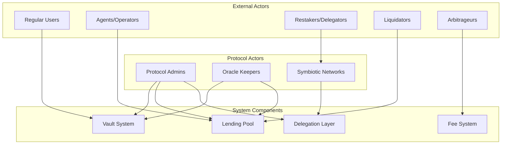
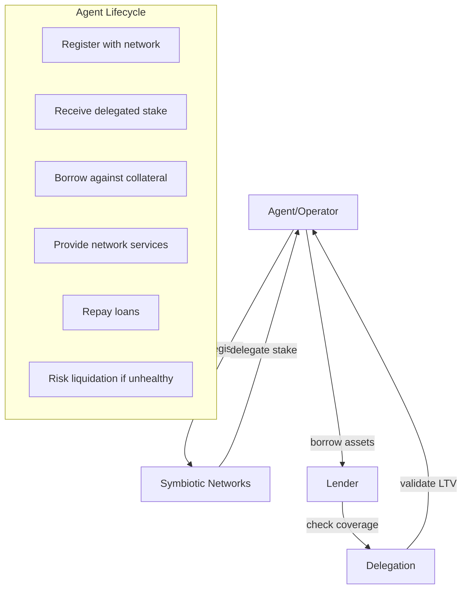
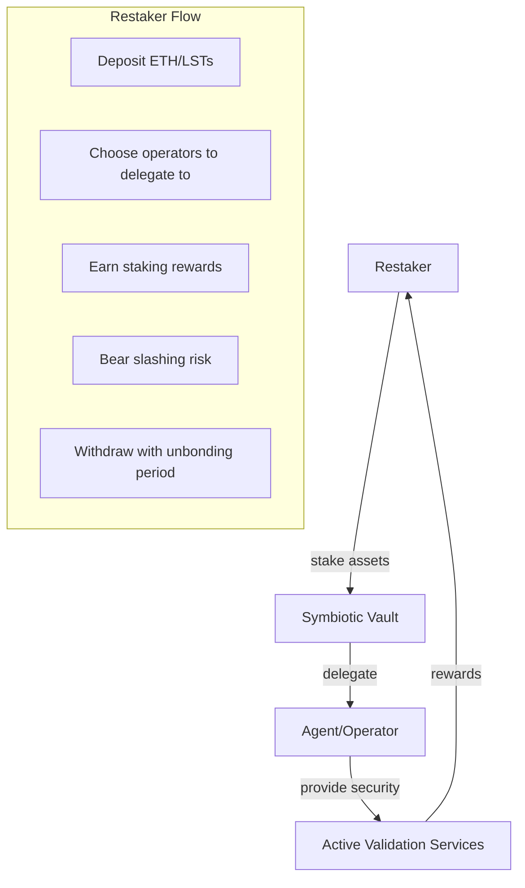
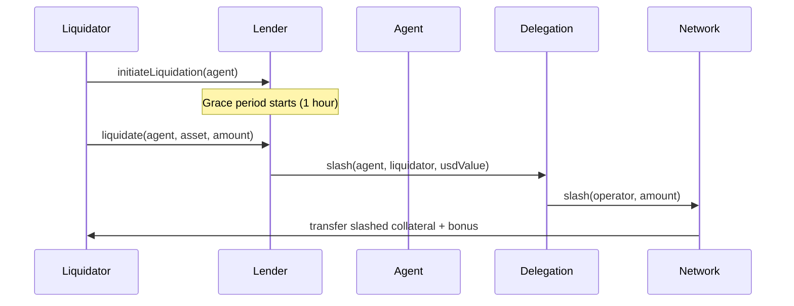
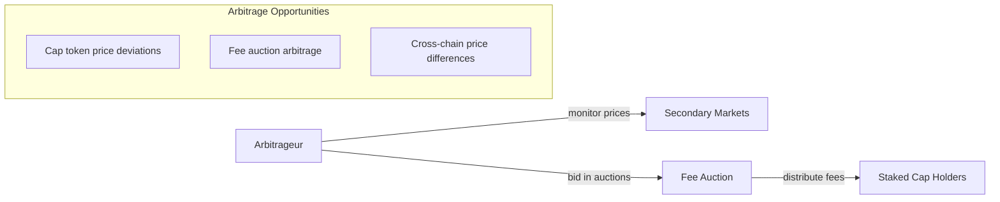
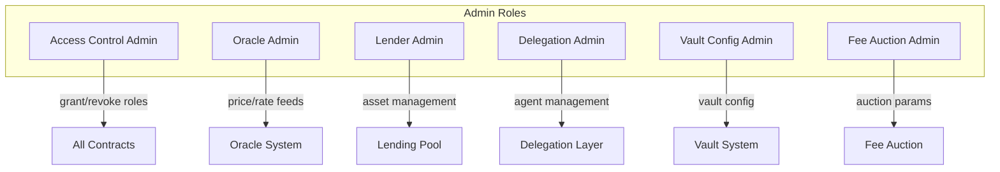
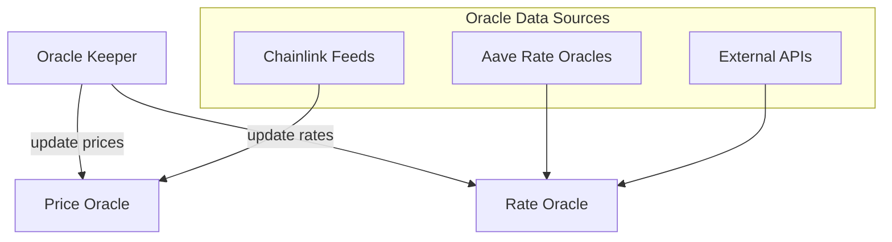
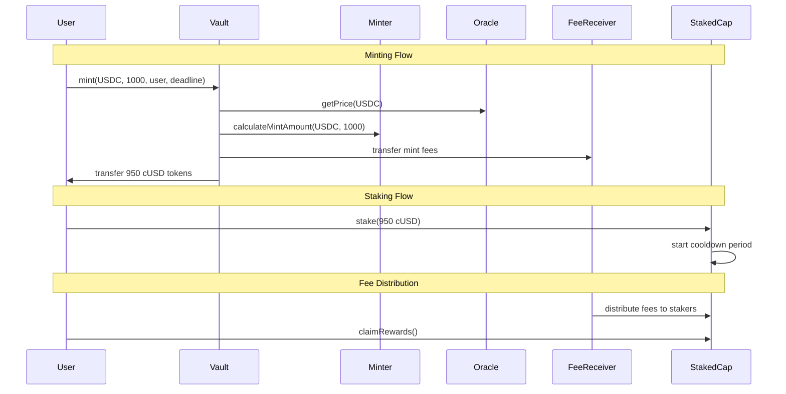
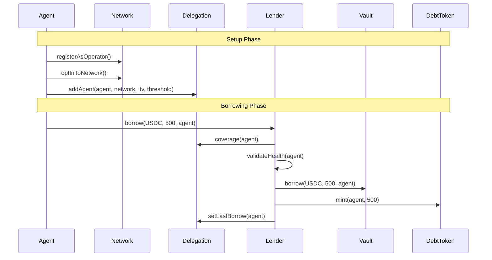
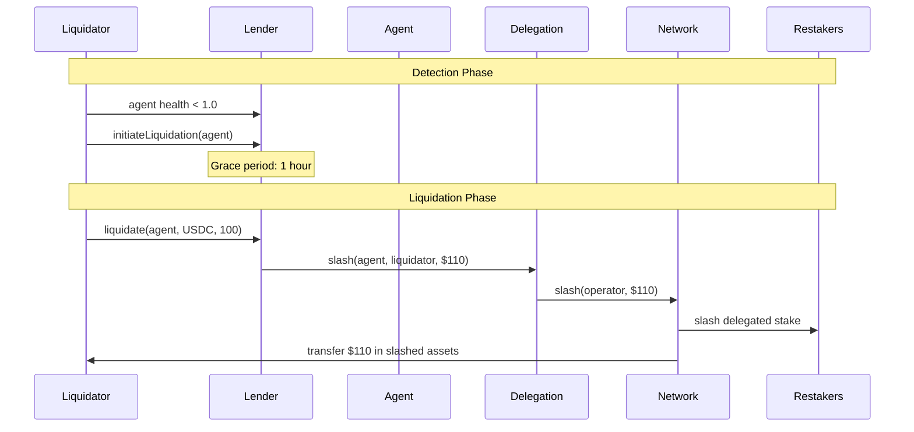

# Actors and Interactions

This document describes all the actors in the Cap Protocol system and their possible interactions.

## System Actors Overview



## Actor Categories

### 1. Regular Users (Liquidity Providers)

**Role**: Provide liquidity to earn yield on their assets

```mermaid
graph LR
    User[Regular User] --> |deposit assets| Vault
    Vault --> |mint cTokens| User
    User --> |burn cTokens| Vault
    Vault --> |withdraw assets| User
    
    subgraph "User Actions"
        A[mint() - Deposit assets for cTokens]
        B[burn() - Redeem specific asset]
        C[redeem() - Redeem bundle of assets]
        D[stake() - Stake cTokens for rewards]
    end
```

**Possible Interactions**:
- `mint(asset, amount, receiver, deadline)` - Deposit assets to receive Cap tokens
- `burn(asset, amountIn, minAmountOut, receiver, deadline)` - Burn Cap tokens for specific asset
- `redeem(amountIn, minAmountsOut, receiver, deadline)` - Burn Cap tokens for bundle of assets
- `stake(amount)` - Stake Cap tokens in StakedCap for fee rewards
- `unstake(amount)` - Unstake with cooldown period
- `claimRewards()` - Claim accumulated fee rewards

### 2. Agents/Operators (Borrowers)

**Role**: Provide services to restaking networks and borrow against delegated stake



**Possible Interactions**:
- `borrow(asset, amount, receiver)` - Borrow assets against delegated collateral
- `repay(asset, amount, agent)` - Repay borrowed assets
- `realizeRestakerInterest(agent, asset)` - Realize accrued interest
- Network registration and opt-in operations
- Delegation management through Symbiotic networks

**Risk Profile**:
- Must maintain health ratio above liquidation threshold
- Subject to slashing if network misbehaves
- Restaker interest accrues on borrowed amounts

### 3. Restakers/Delegators

**Role**: Stake ETH/LSTs to back agents and earn restaking rewards



**Possible Interactions**:
- Deposit assets into Symbiotic vaults
- Delegate to agents/operators  
- Claim restaking rewards
- Withdraw stake (subject to unbonding periods)
- Bear slashing risk for agent misbehavior

### 4. Liquidators

**Role**: Maintain system health by liquidating unhealthy agents



**Possible Interactions**:
- `initiateLiquidation(agent)` - Start liquidation process for unhealthy agent
- `cancelLiquidation(agent)` - Cancel if agent becomes healthy
- `liquidate(agent, asset, amount)` - Execute liquidation after grace period
- Monitor agent health ratios
- Receive liquidation bonuses (up to 10% bonus cap)

**Economic Incentives**:
- Liquidation bonus for maintaining system health
- Gas costs offset by bonus
- Competitive liquidation environment

### 5. Arbitrageurs

**Role**: Maintain efficient markets and participate in fee auctions



**Possible Interactions**:
- Monitor Cap token prices across DEXs
- Participate in fee auctions
- Cross-chain arbitrage via LayerZero
- MEV opportunities around liquidations

### 6. Protocol Admins

**Role**: Manage protocol configuration and parameters



**Administrative Functions**:
- Asset management (add/remove/pause assets)
- Oracle configuration (price feeds, rate sources)
- Agent management (add/modify/remove agents)
- Fee structure updates
- Emergency pause controls
- Access control management

### 7. Oracle Keepers

**Role**: Maintain accurate price and rate feeds



**Responsibilities**:
- Price feed updates for all supported assets
- Benchmark rate updates
- Restaker rate management per agent
- Market oracle data maintenance
- Utilization index updates

## Actor Interaction Flows

### Complete User Journey: Vault Operations



### Complete Agent Journey: Borrowing Flow



### Complete Liquidation Flow



## Actor Incentive Alignment

### Users (Liquidity Providers)
- **Earn**: Fee rewards from vault operations
- **Risk**: Smart contract risk, asset price volatility
- **Alignment**: Higher vault utilization = higher fees = higher rewards

### Agents/Operators  
- **Earn**: Network service rewards, leverage on operations
- **Risk**: Slashing risk, liquidation risk, restaker interest costs
- **Alignment**: Maintain healthy positions to avoid liquidation

### Restakers
- **Earn**: Staking rewards, restaker interest from agents
- **Risk**: Slashing risk from agent misbehavior
- **Alignment**: Delegate to reliable agents with good track records

### Liquidators
- **Earn**: Liquidation bonuses (up to 10%)
- **Risk**: Gas costs, timing risk
- **Alignment**: Maintain system health by liquidating unhealthy positions

### Protocol
- **Revenue**: Fees from minting, borrowing, and cross-chain operations
- **Costs**: Oracle maintenance, governance overhead
- **Alignment**: Growth in TVL and utilization drives fee revenue

## Risk Management

### System-wide Safeguards
1. **Grace Periods**: 1-hour grace period before liquidations
2. **Emergency Liquidations**: Immediate liquidation below 0.7 health ratio
3. **Pause Mechanisms**: Asset and protocol-level pause controls
4. **LTV Buffers**: 5% buffer between LTV and liquidation thresholds
5. **Bonus Caps**: Maximum 10% liquidation bonus to prevent over-incentivization

### Agent Risk Controls
1. **Health Monitoring**: Continuous health ratio tracking
2. **Utilization Limits**: Maximum borrowing based on delegated collateral  
3. **Interest Accrual**: Automatic interest calculation and realization
4. **Network Validation**: Only whitelisted networks can back agents
5. **Minimum Borrow**: Minimum borrow amounts to prevent dust positions 