# Code Map

This document provides a detailed map of the codebase structure, showing how the code is organized and the relationships between different modules.

## Project Structure Overview

```mermaid
graph TB
    subgraph "Root Directory"
        contracts[📁 contracts/]
        test[📁 test/]
        script[📁 script/]
        config[📁 config/]
        lib[📁 lib/]
    end
    
    subgraph "contracts/ Structure"
        access[📁 access/]
        vault[📁 vault/]
        lendingPool[📁 lendingPool/]
        delegation[📁 delegation/]
        oracle[📁 oracle/]
        token[📁 token/]
        feeReceiver[📁 feeReceiver/]
        feeAuction[📁 feeAuction/]
        interfaces[📁 interfaces/]
        storage[📁 storage/]
        zap[📁 zap/]
        deploy[📁 deploy/]
    end
    
    contracts --> access
    contracts --> vault
    contracts --> lendingPool
    contracts --> delegation
    contracts --> oracle
    contracts --> token
    contracts --> feeReceiver
    contracts --> feeAuction
    contracts --> interfaces
    contracts --> storage
    contracts --> zap
    contracts --> deploy
```



## Core Modules Breakdown

### 1. Vault Module (`contracts/vault/`)


**Key Files**:
- `Vault.sol` (281 lines) - Core vault contract for asset management
- `Minter.sol` (95 lines) - Pricing logic for mint/burn operations  
- `FractionalReserve.sol` (121 lines) - Reserve management for fractional backing
- `libraries/VaultLogic.sol` - Core vault operation implementations
- `libraries/MinterLogic.sol` - Fee calculation and pricing logic

### 2. Lending Pool Module (`contracts/lendingPool/`)


**Key Files**:
- `Lender.sol` (335 lines) - Main lending contract
- `libraries/BorrowLogic.sol` - Borrow and repay implementations
- `libraries/LiquidationLogic.sol` - Liquidation process logic
- `libraries/ViewLogic.sol` - Health calculations and views
- `tokens/DebtToken.sol` - Interest-bearing debt tokens

### 3. Delegation Module (`contracts/delegation/`)


**Key Files**:
- `Delegation.sol` - Core delegation management
- `adapters/SymbioticNetworkAdapter.sol` - Symbiotic protocol integration
- `middleware/NetworkMiddleware.sol` - Network middleware interface
- `middleware/StakerRewards.sol` - Reward distribution logic

### 4. Oracle Module (`contracts/oracle/`)


**Key Files**:
- `Oracle.sol` (31 lines) - Main oracle aggregator
- `PriceOracle.sol` (114 lines) - Price feed management
- `RateOracle.sol` (114 lines) - Interest rate management
- `libraries/ChainlinkAdapter.sol` - Chainlink price feed adapter
- `libraries/AaveAdapter.sol` - Aave rate feed adapter

### 5. Token Module (`contracts/token/`)


**Key Files**:
- `CapToken.sol` (40 lines) - Main vault token (extends Vault.sol)
- `StakedCap.sol` (129 lines) - Staking wrapper for fee rewards
- `L2Token.sol` (22 lines) - Layer 2 token implementation
- `OFTPermit.sol` (79 lines) - LayerZero OFT with permit functionality

### 6. Interface Layer (`contracts/interfaces/`)


## Cross-Module Dependencies

### Dependency Graph


### Import Patterns

```mermaid
graph LR
    subgraph "Internal Imports"
        LocalInterfaces[../interfaces/]
        LocalLibraries[./libraries/]
        LocalStorage[../storage/]
        LocalAccess[../access/]
    end
    
    subgraph "External Dependencies"
        OpenZeppelin[@openzeppelin/contracts]
        LayerZero[@layerzerolabs/lz-evm-oapp-v2]
        Symbiotic[Symbiotic Protocol]
    end
    
    Contract[Contract.sol] --> LocalInterfaces
    Contract --> LocalLibraries
    Contract --> LocalStorage
    Contract --> LocalAccess
    Contract --> OpenZeppelin
    Contract --> LayerZero
    Contract --> Symbiotic
```

## Testing Structure (`test/`)

```mermaid
graph TB
    subgraph "Test Categories"
        UnitTests[📁 Unit Tests]
        IntegrationTests[📁 Integration Tests]
        InvariantTests[📁 Invariant Tests]
        ScenarioTests[📁 Scenario Tests]
        Mocks[📁 Mocks]
    end
    
    subgraph "Test Organization"
        VaultTests[vault/]
        LenderTests[lendingPool/]
        DelegationTests[delegation/]
        OracleTests[oracle/]
        FeeTests[fees/]
        DeployTests[deploy/]
    end
    
    subgraph "Test Infrastructure"
        TestBase[TestBase.sol]
        TestUtils[TestUtils.sol]
        MockContracts[mocks/]
        Fixtures[fixtures/]
    end
```



**Key Test Files**:
- `vault/Vault.t.sol` - Core vault functionality tests
- `vault/Vault.invariants.t.sol` - Vault invariant testing
- `lendingPool/Lender.t.sol` - Lending pool tests
- `lendingPool/Lender.invariants.t.sol` - Lending invariants
- `scenario/` - End-to-end scenario tests

## Deployment Structure (`script/` & `contracts/deploy/`)


## Storage Layout (`contracts/storage/`)


## Build & Configuration

### Foundry Configuration (`foundry.toml`)
- **Source**: `contracts/`
- **Test**: `test/`
- **Script**: `script/`
- **Libraries**: `lib/`
- **Solidity Version**: `^0.8.28`
- **Optimizer**: Enabled with 200 runs

### Key Dependencies (`lib/`)
- **OpenZeppelin Contracts**: Core contract primitives
- **LayerZero V2**: Cross-chain messaging
- **Forge Standard Library**: Testing utilities
- **Symbiotic Core**: Restaking infrastructure

### Configuration Files
- `remappings.txt` - Import path mappings
- `gambit.config.json` - Mutation testing configuration
- `slither.config.json` - Static analysis configuration
- `lefthook.yml` - Git hooks configuration

## Code Quality & Security

### Static Analysis Tools
1. **Slither** - Vulnerability detection
2. **Mythril** - Security analysis
3. **Gambit** - Mutation testing
4. **Solhint** - Linting

### Testing Strategy
1. **Unit Tests** - Individual function testing
2. **Integration Tests** - Cross-contract interactions
3. **Invariant Tests** - Property-based testing
4. **Scenario Tests** - End-to-end user journeys
5. **Fuzzing** - Edge case discovery

### Gas Optimization
- Efficient storage layouts using ERC-7201
- Packed structs for reduced storage costs
- Optimized loop patterns
- Minimal external calls
- Cache storage reads

### Upgradeability Patterns
- UUPS proxy pattern for core contracts
- Storage gap preservation
- Version-aware initialization
- Admin-controlled upgrades with timelock

This code map provides developers with a comprehensive understanding of how the Cap Protocol codebase is structured and organized, making it easier to navigate and contribute to the project. 