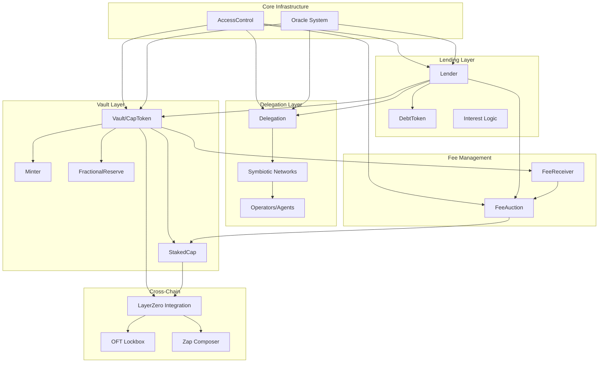
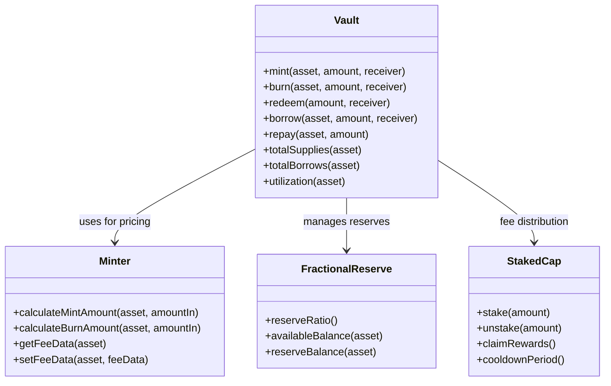
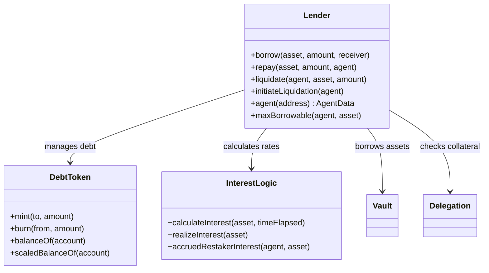
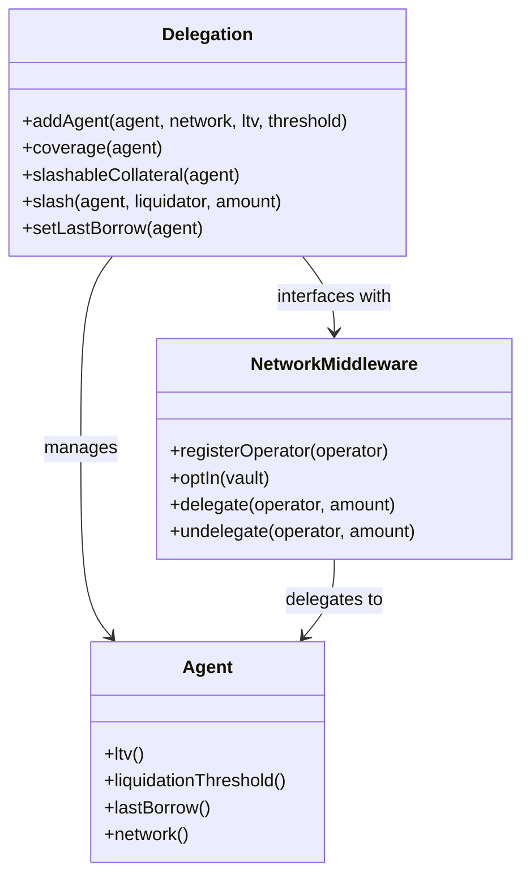
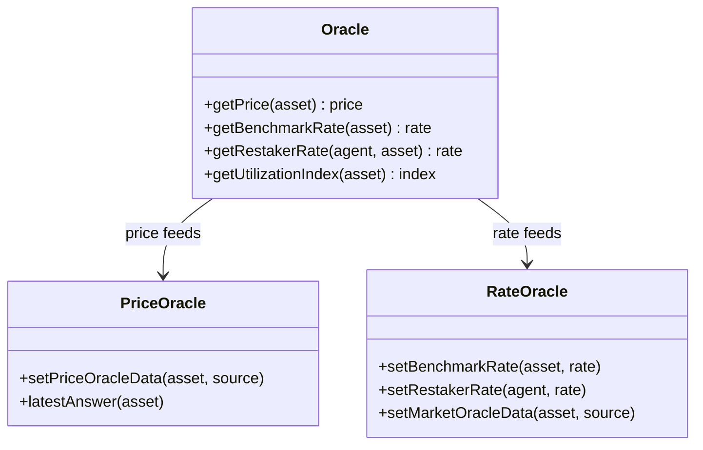
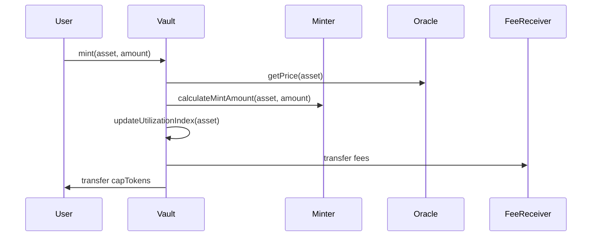
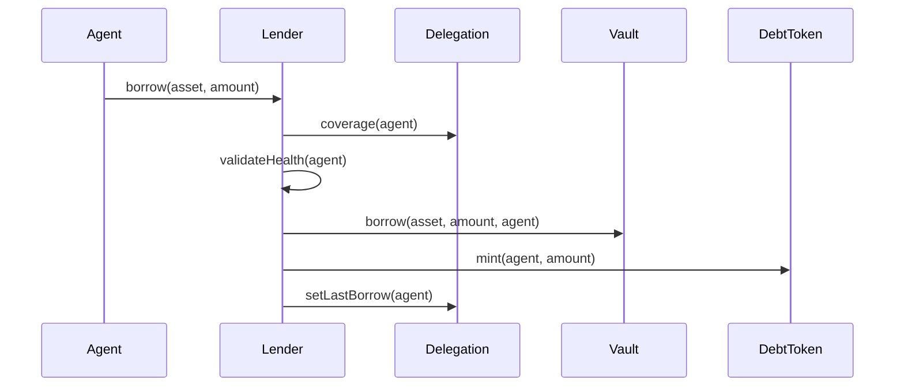
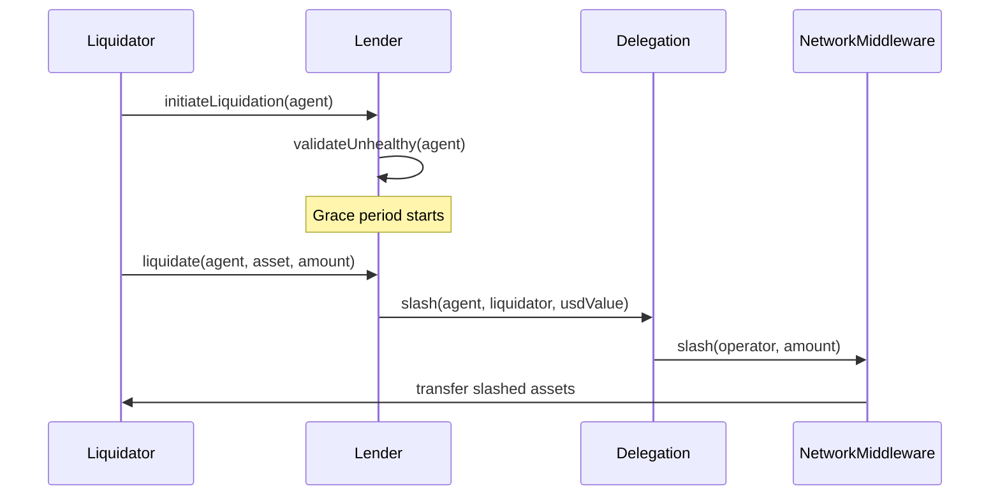
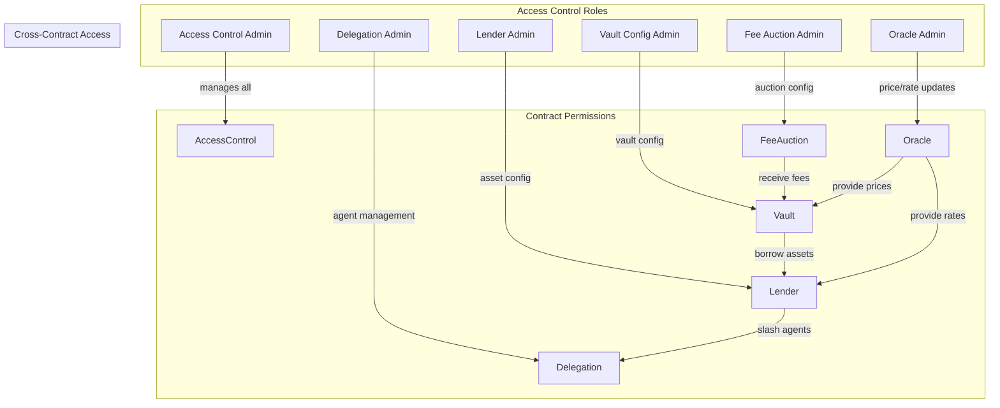
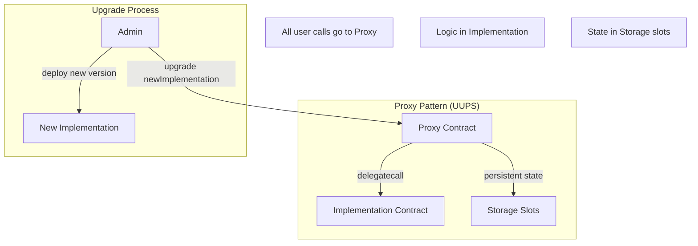

# Contract Architecture

This document outlines the high-level architecture of the Cap Protocol, showing the main contract categories and their interactions.

## System Overview

## Core Contract Categories

### 1. Vault Layer
**Purpose**: Asset management and token issuance

### 2. Lending Layer
**Purpose**: Credit facilities and debt management

### 3. Delegation Layer
**Purpose**: Restaking infrastructure and slashing

### 4. Oracle System
**Purpose**: Price and rate discovery

## Contract Interactions

### Vault Operations Flow

### Lending Operations Flow

### Liquidation Flow

## Access Control Architecture

## Upgradeability Pattern

## Key Design Patterns

1. **UUPS Upgradeable**: All core contracts use OpenZeppelin's UUPS proxy pattern
2. **Access Control**: Role-based permissions with function-level granularity  
3. **Storage Slots**: ERC-7201 namespace storage to avoid collisions
4. **Modular Architecture**: Clear separation between vault, lending, delegation layers
5. **Oracle Abstraction**: Pluggable oracle sources for prices and rates
6. **Emergency Controls**: Pause mechanisms at asset and protocol levels 