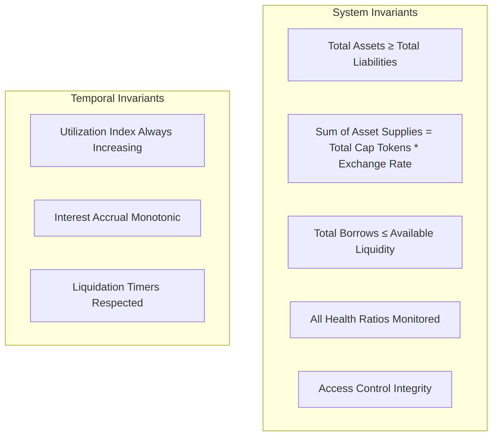
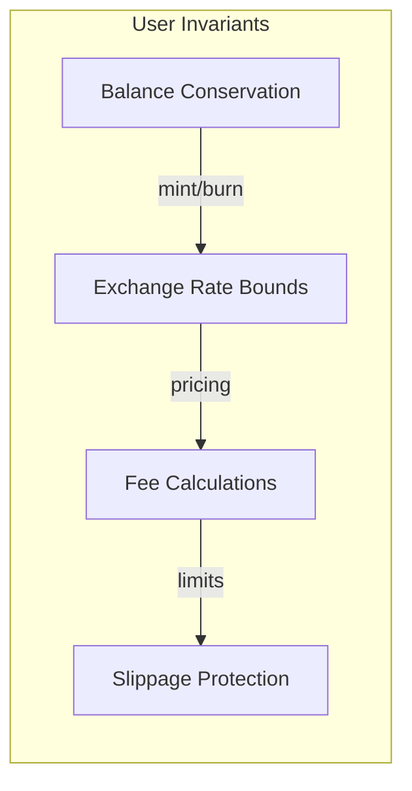
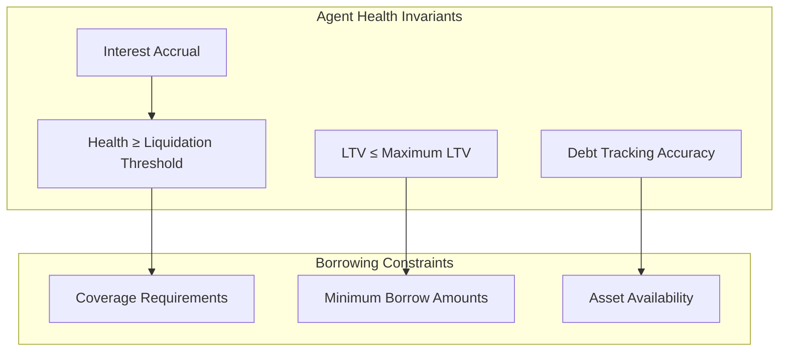
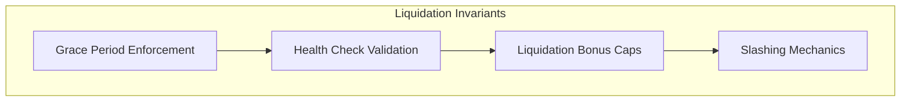
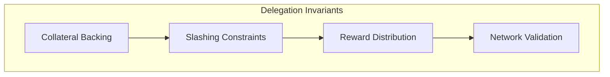
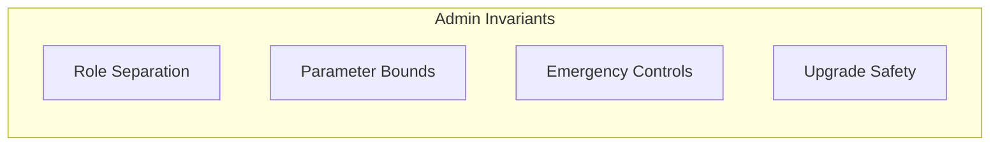
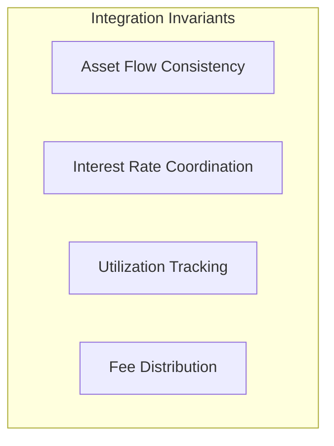
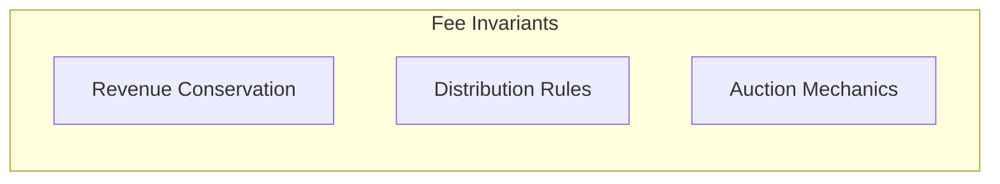
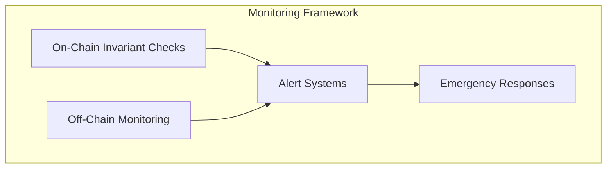

# System Invariants

This document outlines all the critical invariants that must hold true for each actor and system component in the Cap Protocol. Invariants are properties that must always remain true during system operation to ensure security, correctness, and economic stability.

## Table of Contents

1. [System-Level Invariants](#system-level-invariants)
2. [Vault Layer Invariants](#vault-layer-invariants)
3. [Lending Layer Invariants](#lending-layer-invariants)
4. [Delegation Layer Invariants](#delegation-layer-invariants)
5. [Actor-Specific Invariants](#actor-specific-invariants)
6. [Cross-Component Invariants](#cross-component-invariants)
7. [Economic Invariants](#economic-invariants)
8. [Security Invariants](#security-invariants)

## System-Level Invariants

### Core Protocol Invariants

**I1. Protocol Solvency**
- `totalAssetValue ≥ totalLiabilities` at all times
- The protocol must always be able to honor withdrawal requests

**I2. Token Supply Consistency**
- `Σ(assetSupplies[i] * prices[i]) ≥ totalCapTokens * exchangeRate`
- Cap tokens must be fully backed by underlying assets

**I3. Utilization Bounds**
- `0 ≤ utilization[asset] ≤ 1e27` (100% in ray precision)
- `totalBorrows[asset] ≤ totalSupplies[asset]` for all assets

**I4. Access Control Integrity**
- Only authorized addresses can call privileged functions
- Role hierarchies maintained (Access Control Admin > specific admins)

**I5. Pause State Consistency**
- When protocol is paused, no new operations can occur
- Emergency functions remain accessible during pause

## Vault Layer Invariants

### Regular Users (Liquidity Providers)

**I6. Balance Conservation (Minting)**
- `userAssetBalance_before - amountIn = userAssetBalance_after`
- `userCapTokens_after - userCapTokens_before = amountOut`
- `amountOut ≥ minAmountOut` (slippage protection)

**I7. Balance Conservation (Burning)**
- `userCapTokens_before - amountIn = userCapTokens_after`
- `userAssetBalance_after - userAssetBalance_before = amountOut`
- `amountOut ≥ minAmountOut` (slippage protection)

**I8. Exchange Rate Bounds**
- Exchange rate never decreases unless justified by legitimate losses
- `newExchangeRate ≥ oldExchangeRate * (1 - maxSlippageAllowed)`

**I9. Fee Calculation Consistency**
- `fee = calculateFee(asset, amount, utilizationRatio)`
- `fee ≤ maxFeePercentage * amount`
- Fees properly transferred to FeeReceiver

**I10. Staking Invariants**
- `stakedCapBalance[user] ≤ capTokenBalance[user] + allowedStaking`
- Cooldown periods respected for unstaking
- Rewards accumulate proportionally to stake

### Vault Operations

**I11. Asset Accounting**
- `totalSupplies[asset] = Σ(deposits) - Σ(withdrawals) + Σ(returns) - Σ(borrows)`
- `availableBalance[asset] = totalSupplies[asset] - totalBorrows[asset]`

**I12. Utilization Index Monotonicity**
- `currentUtilizationIndex[asset] ≥ previousUtilizationIndex[asset]`
- Index increases based on time elapsed and utilization rate

**I13. Reserve Management**
- `reserveBalance[asset] ≥ minimumReserveRatio * totalSupplies[asset]`
- Fractional reserve maintains minimum liquidity buffer

## Lending Layer Invariants

### Agents/Operators (Borrowers)

**I14. Health Ratio Maintenance**
- `health[agent] = (totalDelegation * liquidationThreshold) / totalDebt`
- `health[agent] ≥ 1e27` or liquidation can be initiated
- `health[agent] < emergencyLiquidationThreshold` enables immediate liquidation

**I15. LTV Constraints**
- `ltv[agent] = totalDebt / totalDelegation`
- `ltv[agent] ≤ maxLTV[agent]` configured per agent
- LTV buffer maintained: `liquidationThreshold > ltv + ltvBuffer`

**I16. Debt Tracking Accuracy**
- `totalDebt[agent] = Σ(debtToken.balanceOf(agent) * prices[asset])`
- Debt includes accrued interest: `debt = principal + accruedInterest`
- Interest realizes over time based on restaker rates

**I17. Borrowing Constraints**
- `borrowAmount ≤ maxBorrowable[agent][asset]`
- `borrowAmount ≥ minBorrow[asset]` (prevents dust)
- `coverage[agent] ≥ borrowAmount / ltv[agent]`

**I18. Delegation Coverage**
- `totalDelegation[agent] = Σ(networkCoverage[network]) ≥ totalDebt[agent] / ltv[agent]`
- Delegation remains slashable until debt repaid

### Debt Management

**I19. Debt Token Consistency**
- `debtToken.totalSupply() = Σ(debt[agent])` across all agents
- Scaled balance reflects interest accrual: `scaledBalance * index = currentBalance`

**I20. Interest Accrual**
- Interest accrues continuously based on time and rates
- `accruedInterest = principal * rate * timeElapsed / SECONDS_IN_YEAR`
- Restaker interest paid to delegation networks

**I21. Repayment Processing**
- Repayments reduce debt proportionally
- `newDebt = oldDebt - repaymentAmount`
- Cannot repay more than outstanding debt

### Liquidators

**I22. Liquidation Triggering**
- Liquidation only possible when `health[agent] < 1e27`
- Grace period must expire: `block.timestamp ≥ liquidationStart[agent] + gracePeriod`
- Emergency liquidations bypass grace: `health[agent] < emergencyThreshold`

**I23. Grace Period Management**
- `liquidationStart[agent]` set when health first drops below threshold
- Grace period = 1 hour for normal liquidations
- Liquidation expires after `gracePeriod + expiryPeriod`

**I24. Liquidation Bonus Bounds**
- `liquidationBonus ≤ bonusCap` (maximum 10%)
- `liquidatedValue = repayAmount * (1 + liquidationBonus)`
- Bonus comes from slashed delegation, not protocol funds

**I25. Partial Liquidation Rules**
- Liquidation brings agent health to `targetHealth` (1.33x)
- `maxLiquidatable = calculateMaxLiquidation(agent, targetHealth)`
- Cannot over-liquidate beyond restoring health

## Delegation Layer Invariants

### Restakers/Delegators

**I26. Collateral Backing**
- `totalDelegation[agent] = Σ(stakedAssets * prices) in delegation networks`
- `slashableCollateral[agent] ≤ totalDelegation[agent]`
- Delegation exists and is slashable for borrowed amounts

**I27. Network Registration**
- Only registered networks can provide delegation
- Agents must be registered with valid networks
- `networks[agent] ∈ registeredNetworks`

**I28. LTV Configuration**
- `ltv[agent] ≤ maxLTV` globally enforced
- `liquidationThreshold[agent] > ltv[agent] + ltvBuffer`
- Configuration changes don't violate existing health ratios

**I29. Slashing Mechanics**
- Slashing only occurs during liquidation
- `slashedAmount ≤ slashableCollateral[agent]`
- Slashed funds go to liquidator (not protocol)

**I30. Epoch Management**
- `currentEpoch = block.timestamp / epochDuration`
- Slashing timestamp considers epoch boundaries
- `slashTimestamp[agent] = max(lastBorrow[agent], previousEpochStart)`

### Network Integration

**I31. Symbiotic Integration**
- Network middleware properly routes delegation
- Operator registration maintained across networks
- Vault opt-ins enable delegation flow

**I32. Reward Distribution**
- Rewards distributed proportionally to delegation
- `rewardShare[network] = networkDelegation[agent] / totalDelegation[agent]`
- Reward tokens properly transferred to networks

## Actor-Specific Invariants

### Protocol Admins

**I33. Access Control Hierarchy**
- Access Control Admin can grant/revoke all roles
- Specific admins limited to their domain functions
- Role changes emit proper events

**I34. Parameter Configuration**
- Oracle prices within reasonable bounds
- Interest rates within economic limits
- Fee parameters don't exceed maximum percentages

**I35. Emergency Controls**
- Pause functionality works at asset and protocol levels
- Emergency liquidations bypass normal constraints
- Admin functions remain accessible during emergencies

### Oracle Keepers

**I36. Price Feed Integrity**
- Prices update within acceptable deviation ranges
- Stale price protection prevents outdated data usage
- Multiple oracle sources provide redundancy

**I37. Rate Oracle Consistency**
- Benchmark rates reflect market conditions
- Restaker rates properly configured per agent
- Utilization indices update based on time and usage

### Arbitrageurs

**I38. Market Efficiency**
- Cap token prices remain close to NAV across markets
- Fee auctions clear at fair market prices
- Cross-chain price deviations within arbitrage bounds

## Cross-Component Invariants

### Vault-Lending Integration

**I39. Asset Flow Tracking**
- `vault.totalBorrows[asset] = lender.totalBorrowedFromVault[asset]`
- Borrows from vault properly recorded in lending pool
- Repayments flow back to vault reserves

**I40. Utilization Coordination**
- Vault utilization reflects lending pool activity
- Interest accrual coordinated between components
- Fee distribution follows proper waterfall

### Oracle-System Integration

**I41. Price Consistency**
- All components use same oracle prices
- Price staleness checked before critical operations
- Backup oracles activate during primary failure

**I42. Rate Synchronization**
- Lending rates reflect oracle-provided benchmarks
- Vault utilization indices updated consistently
- Cross-component rate calculations aligned

## Economic Invariants

### Fee Economics

**I43. Fee Conservation**
- Total fees collected = Total fees distributed + Protocol reserves
- Fees flow: Users → FeeReceiver → FeeAuction → StakedCap holders
- No fee leakage outside intended recipients

**I44. Auction Mechanics**
- Auction duration and pricing follow configured rules
- Minimum bid prices prevent value extraction
- Auction settlements properly distribute tokens

**I45. Cross-Chain Economics**
- LayerZero fees properly accounted for
- Cross-chain arbitrage opportunities limited
- Token transfers maintain proper accounting

## Security Invariants

### Access Control

**I46. Privilege Escalation Prevention**
- No unauthorized access to privileged functions
- Role changes require proper authorization
- Time delays enforced for critical parameter changes

**I47. Reentrancy Protection**
- External calls don't allow reentrancy attacks
- State changes occur before external calls
- Proper use of reentrancy guards

### Economic Attacks

**I48. Flash Loan Protection**
- Critical operations resist flash loan manipulation
- Price updates use time-weighted averages
- Large operations subject to gradual limits

**I49. MEV Resistance**
- Liquidation bonuses prevent excessive MEV extraction
- Grace periods provide fair liquidation access
- Auction mechanisms resist manipulation

## Invariant Monitoring

### Automated Checks

**I50. Continuous Monitoring**
- Critical invariants checked on every state change
- Automated alerts for invariant violations
- Emergency pause triggered for serious violations

**I51. Invariant Testing**
- Fuzzing tests validate invariants under random inputs
- Integration tests verify cross-component invariants
- Stress tests ensure invariants hold under extreme conditions

## Invariant Violation Responses

### Automatic Responses

**I52. Circuit Breakers**
- Automatic pause when critical invariants violated
- Gradual degradation rather than complete failure
- Recovery procedures clearly defined

**I53. Emergency Procedures**
- Admin override capabilities for emergency situations
- Liquidation acceleration when system health threatened
- Asset rescue procedures for extreme scenarios

### Recovery Mechanisms

**I54. Health Restoration**
- Automatic liquidations restore agent health
- Protocol-level rebalancing when needed
- External intervention procedures documented

**I55. System Recovery**
- Upgrade procedures to fix invariant violations
- Data migration capabilities if needed
- Fallback mechanisms for critical failures

---

## Summary

These invariants form the foundation of Cap Protocol's security and correctness. They must be:

1. **Continuously monitored** through automated systems
2. **Tested rigorously** in all development phases  
3. **Enforced programmatically** where possible
4. **Validated regularly** through audits and formal verification

Any violation of these invariants should trigger immediate investigation and appropriate responses to maintain system integrity and user protection. 